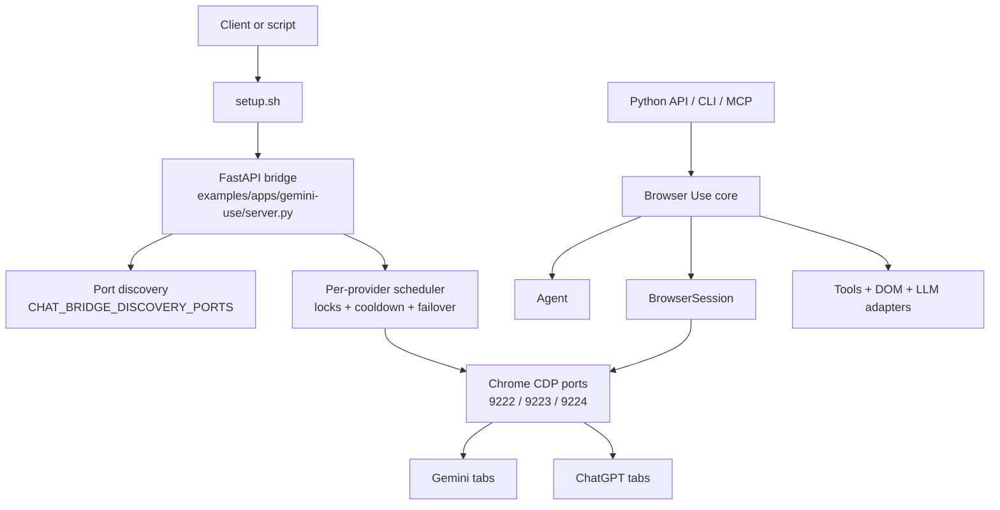

<div align="center">
  

  # Browser Use + Local Gemini/GPT Bridge

  Local-first Browser Use workspace with a repo-native FastAPI bridge for Gemini and ChatGPT tab automation over Chrome CDP.

  
  
  
  
  
  

  [System Overview](#system-overview) •
  [System Flow](#system-flow) •
  [Quick Start](#quick-start) •
  [Pipelines](#application-pipelines) •
  [Deployment Profiles](#deployment-profiles) •
  [Repository Map](#repository-map) •
  [Docs Index](#docs-index) •
  [Notes On Accuracy](#notes-on-accuracy)
</div>

## System Overview

This workspace is two things at once:

| Layer | What it does | Primary entry points |
| --- | --- | --- |
| Browser Use core | Async browser automation library with Agent, BrowserSession, DOM extraction, tools, CLI, MCP server, cloud hooks, and LLM adapters. | `browser_use/agent/service.py`, `browser_use/browser/session.py`, `browser_use/tools/service.py`, `browser_use/mcp/server.py` |
| Local Gemini/GPT bridge | Repo-local FastAPI service that drives authenticated Gemini and ChatGPT tabs through Chrome CDP, with multi-port discovery, batch prompt dispatch, and image generation responses. | `examples/apps/gemini-use/server.py`, `setup.sh`, `.env.example` |

The practical runtime path in this repo is local-first: open Chrome with remote debugging, let the bridge manage one or more CDP ports, then send batch chat or image requests to Gemini or GPT tabs.

| Use this repo when | Why |
| --- | --- |
| You want a local bridge over already logged-in Gemini or ChatGPT web tabs | The bridge talks to browser sessions over CDP instead of official model APIs |
| You want to keep the upstream Browser Use library available in the same workspace | The fork keeps the core Agent, BrowserSession, tools, CLI, and MCP surfaces |
| You need batch fan-out across multiple Chrome debug ports | The bridge includes per-port scheduling, cooldown, and failover logic |
| You need official API compatibility guarantees | Do not use this path; this repo automates web UIs and is constrained by DOM and session state |

| Current bridge behavior verified from source | Status |
| --- | --- |
| `POST /v1/web/open` opens or reconnects managed Chrome ports | Present |
| `GET/POST /v1/ports/ping` inspects managed ports | Present |
| `POST /v1/ports/close` closes managed sessions on a port | Present |
| `POST /v1/chat/gemini` and `POST /v1/chat/gpt` accept `prompt: list[str]` | Present |
| `POST /v1/image/gemini` and `POST /v1/image/gpt` support `response_format=json|binary` | Present |
| OpenAPI docs at `/docs` and schema at `/openapi.json` | Present |

## System Flow



## Quick Start

Use Git Bash on Windows or a POSIX shell on Linux/macOS.

```bash
uv venv --python 3.11
source .venv/Scripts/activate
uv sync --all-extras --dev
./setup.sh
```

What `setup.sh` does in this repo:

| Step | Effect |
| --- | --- |
| Load runtime config | Reads `.env.example`, then `.env` overrides if present |
| Validate Python runtime | Requires Python 3.11+ |
| Prepare dependencies | Uses `uv` workflow expected by the repo |
| Start bridge runtime | Brings up the Gemini/GPT FastAPI bridge |
| Fail fast on ports | Does not auto-shift busy API or broken CDP ports |

After startup:

```text
OpenAPI: http://127.0.0.1:8008/docs
Schema:  http://127.0.0.1:8008/openapi.json
```

Minimal live sequence:

```bash
curl -X POST http://127.0.0.1:8008/v1/web/open \
  -H "Content-Type: application/json" \
  -d '{"ports":[9222,9223,9224]}'

curl -X POST http://127.0.0.1:8008/v1/chat/gemini \
  -H "Content-Type: application/json" \
  -d '{"prompt":["Summarize this repo in 3 bullets","List the bridge endpoints"],"timeout_s":600}'

curl -X POST http://127.0.0.1:8008/v1/image/gpt \
  -H "Content-Type: application/json" \
  -d '{"prompt":["diagram of a browser automation pipeline"],"response_format":"binary"}' \
  --output bridge-image.bin
```

## API Surface

All bridge routes are implemented in [examples/apps/gemini-use/server.py](examples/apps/gemini-use/server.py).

| Method | Route | Purpose | Notes |
| --- | --- | --- | --- |
| `POST` | `/v1/web/open` | Open or reconnect managed Chrome ports for Gemini/GPT automation | Accepts `ports: list[int]`; returns `results` and `active_ports` |
| `GET` | `/v1/ports/ping` | Probe the default managed port set | Uses discovered ports when no explicit list is provided |
| `POST` | `/v1/ports/ping` | Probe an explicit list of ports | Useful for checking multi-port bridge health |
| `POST` | `/v1/ports/close` | Close one managed session on a port | Can target one provider or both |
| `POST` | `/v1/chat/gemini` | Run Gemini chat automation | `prompt` is a required list; batch returns per-item `results` |
| `POST` | `/v1/chat/gpt` | Run ChatGPT chat automation | Same request/response contract as Gemini chat |
| `POST` | `/v1/image/gemini` | Run Gemini image generation automation | Supports `response_format=json|binary` |
| `POST` | `/v1/image/gpt` | Run ChatGPT image generation automation | Supports `response_format=json|binary` |

## Application Pipelines

| Pipeline | Input | Runtime behavior | Output |
| --- | --- | --- | --- |
| Core agent pipeline | Python code using `Agent`, `Browser`, tools, and any supported LLM adapter | Browser Use orchestrates steps, DOM snapshots, tool calls, and browser actions | `AgentHistoryList`, structured outputs, screenshots, files |
| Local bridge open pipeline | `POST /v1/web/open` with one or more CDP ports | Bridge probes ports, opens provider tabs, registers ports into schedulers | Open result list plus `active_ports` |
| Local bridge chat pipeline | `POST /v1/chat/{provider}` with `prompt: list[str]` | Prompts are dispatched across available ports with per-port locks, cooldown, and transient failover | Single or batch `ChatResponse` with per-item results |
| Local bridge image pipeline | `POST /v1/image/{provider}` with `prompt: list[str]` | UI automation waits for generated images, supports JSON payloads or first-success binary streaming | `ImageResponse` JSON or raw image bytes |
| MCP pipeline | `browser-use --mcp` | Starts MCP server without full CLI logging initialization | MCP-exposed browser automation tools |

### Bridge Runtime Controls

| Variable | Default | Why it matters |
| --- | --- | --- |
| `GEMINI_CDP_URL` | `http://127.0.0.1:9222` | Base CDP endpoint used to derive managed ports |
| `CHAT_BRIDGE_DISCOVERY_PORTS` | `9222,9223,9224` | Pool used for multi-port open, ping, and batch dispatch |
| `GEMINI_OPEN_URL` | `https://gemini.google.com/app` | Default URL for Gemini tab bring-up |
| `GPT_OPEN_URL` | `https://chatgpt.com/` | Default URL for GPT tab bring-up |
| `GEMINI_DEFAULT_TIMEOUT_S` | `600` | Default chat/image timeout for Gemini flows |
| `GPT_DEFAULT_TIMEOUT_S` | `600` | Default chat/image timeout for GPT flows |
| `CHAT_BRIDGE_RATE_LIMIT_COOLDOWN_S` | `45` | Cooldown window after rate-limit detection |
| `CHAT_BRIDGE_MAX_BATCH_PROMPTS` | `24` | Upper bound for prompt fan-out |
| `GEMINI_API_PORT` | `8008` | HTTP port for the FastAPI bridge |

## Deployment Profiles

| Profile | Use when | Start command | Notes |
| --- | --- | --- | --- |
| Local bridge runtime | You want HTTP endpoints for Gemini or ChatGPT tabs running in your own browser profile | `./setup.sh` | This is the shortest path for this fork |
| Library runtime | You want direct Python control with Browser Use abstractions | `uv run python examples/simple.py` | Works independently of the bridge |
| MCP server runtime | You want Browser Use tools exposed to an MCP client | `uv run browser-use --mcp` | Implemented in `browser_use/mcp/server.py` |
| Cloud-assisted runtime | You want Browser Use cloud browser / sandbox features | Python code with `Browser(use_cloud=True)` or `@sandbox()` | Optional, requires `BROWSER_USE_API_KEY`; not required for the local bridge path |

## Repository Map

| Path | Role |
| --- | --- |
| [pyproject.toml](pyproject.toml) | Package metadata, dependencies, optional extras, pytest, pyright, and ruff configuration |
| [setup.sh](setup.sh) | Bring-up script for the local Gemini/GPT bridge |
| [bin/lint.sh](bin/lint.sh) | Local lint, format, type-check, pre-commit wrapper |
| [bin/test.sh](bin/test.sh) | CI-like test runner for `tests/ci` |
| [browser_use/agent/service.py](browser_use/agent/service.py) | Main agent orchestration layer |
| [browser_use/browser/session.py](browser_use/browser/session.py) | Browser lifecycle and CDP session management |
| [browser_use/tools/service.py](browser_use/tools/service.py) | Action registry used by the agent |
| [browser_use/mcp/server.py](browser_use/mcp/server.py) | MCP server entry point |
| [examples/apps/gemini-use/server.py](examples/apps/gemini-use/server.py) | Repo-local FastAPI bridge for Gemini/GPT chat and image automation |
| [tests/ci/test_gemini_bridge_batch.py](tests/ci/test_gemini_bridge_batch.py) | Focused regression coverage for batch bridge behavior |
| [docs/multi-port-batch-bridge-2026-05-12.md](docs/multi-port-batch-bridge-2026-05-12.md) | Human-readable implementation note for the multi-port batch bridge change |
| [logs/multi-port-batch-bridge-2026-05-12.log.md](logs/multi-port-batch-bridge-2026-05-12.log.md) | Execution log for the batch bridge task |
| [logs-fix/2026-05-08-gemini-gpt-four-endpoints.md](logs-fix/2026-05-08-gemini-gpt-four-endpoints.md) | Earlier hardening and API-surface notes |

## Docs Index

| Read this when you need | File |
| --- | --- |
| Upstream-style contributor and repo behavior rules | [AGENTS.md](AGENTS.md) |
| Additional architecture and codebase guidance | [CLAUDE.md](CLAUDE.md) |
| Cloud-related notes and setup | [CLOUD.md](CLOUD.md) |
| Multi-port batch bridge design summary | [docs/multi-port-batch-bridge-2026-05-12.md](docs/multi-port-batch-bridge-2026-05-12.md) |
| What was changed during the batch bridge task | [logs/multi-port-batch-bridge-2026-05-12.log.md](logs/multi-port-batch-bridge-2026-05-12.log.md) |
| Why the bridge surface changed on 2026-05-08 | [logs-fix/2026-05-08-gemini-gpt-four-endpoints.md](logs-fix/2026-05-08-gemini-gpt-four-endpoints.md) |
| Package-level docs for the Python library | [browser_use/README.md](browser_use/README.md) |
| Working examples | [examples/](examples/) |

## Development

```bash
uv sync --all-extras --dev
uv run pytest -q tests/ci/test_gemini_bridge_batch.py
./bin/test.sh
./bin/lint.sh --quick
```

Focused validation that already exists in-tree for the bridge rewrite:

| Check | What it covers |
| --- | --- |
| `tests/ci/test_gemini_bridge_batch.py` | Prompt extraction, multi-port open, rate-limit failover, binary image response |
| `GET /docs` and `GET /openapi.json` | Runtime documentation surface |
| `logs/multi-port-batch-bridge-2026-05-12.log.md` | Recorded live validation against ports `9222/9223/9224` |

## Notes On Accuracy

1. This README describes the workspace as it exists in source today, not only the upstream `browser-use` package published on PyPI.
2. The bridge currently exposes seven business endpoints plus `/docs` and `/openapi.json`; older logs in this repo document earlier intermediate API shapes.
3. Chat and image bridge requests are documented here using the current schema: `prompt` is a required list, not a single string.
4. Cloud browser and sandbox features are real in this codebase, but they are optional. The local Gemini/GPT bridge path does not require paid Browser Use cloud services.
5. If README text and code ever diverge, treat `examples/apps/gemini-use/server.py`, `.env.example`, and the CI tests as the source of truth.

## License

MIT. See [LICENSE](LICENSE).
